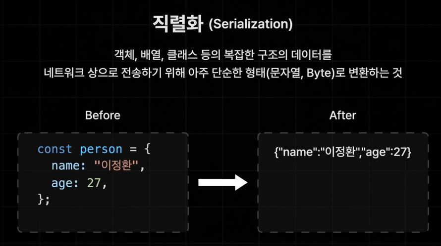

### React Server Component 주의 사항

1. `서버 컴포넌트`에는 브라우저에서 실행될 코드가 포함하면 안된다.

   - 브라우저에서 실행되지 않는다.

2. `클라이언트 컴포넌트`는 클라이언트에서만 실행되지 않는다.

   - 전부터 사용해 오던 일반적인 컴포넌트이기 때문에 서버와 클라이언트에서 모두 실행
   - 사전 렌더링을 위해 서버에서 1번 실행, 하이드레이션을 위해 브라우저에서 1번 실행

3. `클라이언트 컴포넌트`에서 `서버 컴포넌트`를 **`import`** 할 수 없다.

   - 서버 컴포넌트의 코드는 오직 서버에서만 실행되기 때문
   - 클라이언트 컴포넌트에서 서버 컴포넌트를 불러오려고 한다면 `children` 으로 전달할 것

4. `서버 컴포넌트`에서 `클라이언트 컴포넌트`에게 직렬화되지 않는 Props는 전달 불가하다.
   - 함수는 직렬화가 불가능함

 

